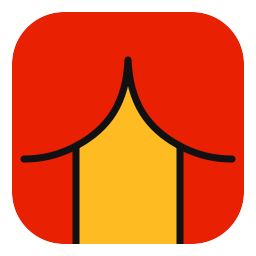
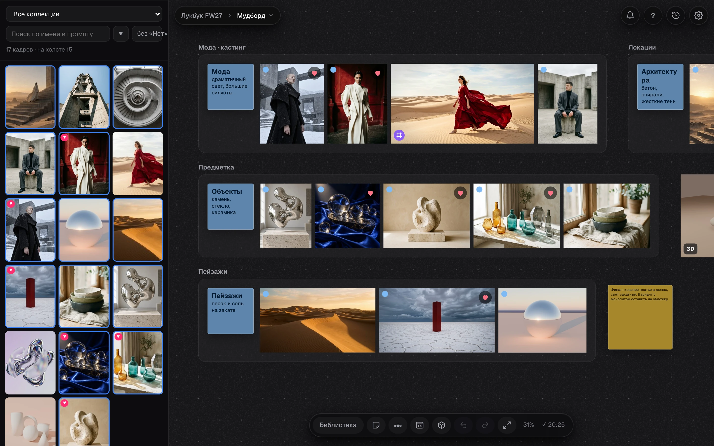
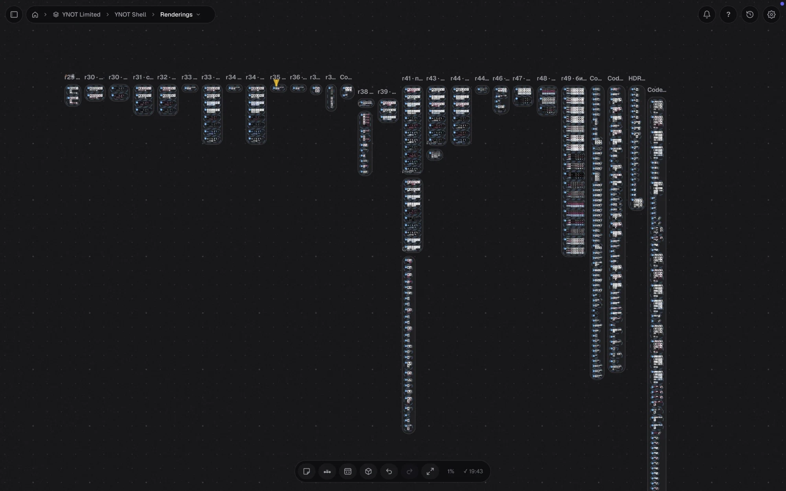
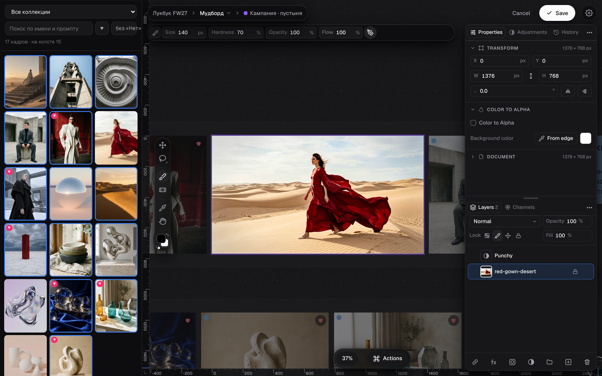

<p align="center"></p>

<h1 align="center">Hyimg</h1>



Демо-доска: группы с заметками, библиотека слева, на доске фрейм картинок и 3D-карточка из плагинов



Большая доска: 7000 кадров в группах, масштаб 1 %



Редактор фрейма открывается на месте карточки, доска и библиотека остаются рядом

Приложение для Mac: проекты, библиотека изображений и холст для отбора кадров. Нативное окно на Swift и AppKit открывает существующий интерфейс библиотеки и холста через WKWebView. Сервер запускается автоматически.

## Плагины: Фреймы и 3D-объекты

Hyimg работает и без них, но с ними доска умеет больше. Каждый плагин живет в своем репозитории:

- **Фреймы**, https://github.com/constantvis/hyimg-frames: фрейм картинок с редактором прямо на доске (слои, маски, кисть, Color Grading, заливка с учетом содержимого) и HTML-фрейм, живая страница карточкой. Маска объекта через macOS Vision, он встроен в систему. Для заливки нужна модель LaMa (около 208 МБ, `~/Library/Caches/Hyimg/models/lama`), ее скачивает только `--lama`.
- **3D-объекты**, https://github.com/constantvis/hyimg-3d-studio: 3D-сцена карточкой на доске, свой редактор на three.js, снимок в картинку. Для переноса сцены в Blender и обратно нужен Blender.

```sh
./scripts/install_plugins.sh            # спросит про каждый плагин
./scripts/install_plugins.sh --frames --3d --yes   # без вопросов, для агента после ответа человека
```

Скрипт берет копии рядом с этим репозиторием или клонирует их туда и ставит ссылки в `~/Library/Application Support/Hyimg/plugins`. Потом Вид › Перезапустить сервер (⇧⌘R).

**Агенту:** перед установкой Hyimg или при первой работе с ним спроси человека про каждый плагин по имени, скажи, что он дает и что ему нужно, ставь только после «да». Подробно в `AGENTS.md`, раздел «Плагины: спросить человека».

## Работа с проектами

Откройте Hyimg. На экране проектов можно подключить существующую папку или создать новую. Подключение сохраняет ссылку на папку. Изображения остаются на месте, подпапки показываются как коллекции.

У каждого проекта свои доски, история, оценки и настройки. Название проекта можно поменять. Если папка переместилась, выберите ее новое расположение через перепривязку. Это действие меняет ссылку в каталоге приложения.

В библиотеке и на холсте сохраняются привычные действия: выбор кадров, группы, страницы, комментарии, оценки, вставка изображений и перетаскивание файлов.

## Для агентов: инструкция по ссылке

Агенту достаточно ссылки на проект. По адресу `http://localhost:<порт>/agent` (то же `/llms.txt` и `python3 review/hy.py guide`) сервер отдает инструкцию: что открыто у пользователя, страницы холста, правила проекта из `<libraryRoot>/AGENTS.md` целиком, пути скиллов и команды. Страницы библиотеки и холста указывают туда же.

Скиллы лежат в `skills/`: `hyimg` (с чего начать, данные, как улучшать правила), `hyimg-board` (холст через `hy.py`: `block ... near=`, `arrange`, `remove`, `check`), `hyimg-generate` (генерация в проект, 5 попыток на промпт, json рядом с картинкой). `scripts/install_skills.sh` ставит на них ссылки для Gemini CLI, Antigravity, Claude Code и Codex, `--remove` убирает. Поправки пользователя к работе агентов вносятся в эти скиллы или в `AGENTS.md` проекта, тесты команд в `tests/test_agent_tools.py`.

## Для агентов: что открыто у пользователя

Приложение пишет `~/Library/Application Support/Hyimg/active.json` при каждом переключении вкладки, страницы проекта пишут выделение в `<stateRoot>/live.json`. Команда `python3 scripts/active.py` показывает текущий проект, вкладки, выделенное на холсте или в библиотеке и что на экране; `--paths` дает только пути выделенных кадров. Так агент понимает «сделай с этими» в любом проекте без уточнений.

Ссылка на объект: правый клик по кадру, группе, заметке или тексту › «Копировать ссылку» (на пустом месте «Копировать ссылку на этот вид»). Ссылка вида `http://localhost:4180/?view=canvas&page=main&obj=<id>` открывает холст, выделяет объект и ставит его в центр. Агент разбирает присланную ссылку командой `python3 scripts/active.py --link "<ссылка>"`: страница, кадры с путями к файлам, группы со всеми кадрами, текст заметок. Проект определяется по порту ссылки.

## Сборка и установка

Нужны macOS 14 или новее, Xcode Command Line Tools и Python 3.10 или новее с Pillow. Для тестов нужны pytest и Node.js.

```sh
./build.sh
./scripts/install.sh
```

Приложение устанавливается в `~/Applications/Hyimg.app`. Код остается в рабочем репозитории. Сборка содержит резервную копию веб-интерфейса на случай недоступного рабочего репозитория.

Cmd+R обновляет HTML после правок. Shift+Cmd+R перезапускает собственный сервер после изменения Python. Правки Swift требуют повторной сборки и установки. Shift+Cmd+O открывает проект в браузере. Меню «Правка» содержит копирование, вставку, вырезание и отмену.

## Проверки

```sh
python3 -m pytest -q tests/test_server_integration.py
node --test tests/test_canvas_save.mjs
tests/test_native.sh
./build.sh
tests/test_native_cli.sh
tests/test_webkit.sh
```

Проверки создают временные папки и не записывают в пользовательские проекты. Тест WebKit запускает собственный тестовый процесс с окном и сохраняет его снимки во временную папку. Устройство данных описано в `docs/data.md`, правила разработки в `AGENTS.md`, решения по интерфейсу в `DESIGN.md`.

## Движок Chromium

Проекты рисует Chromium (CEF) внутри окна Hyimg, со своими вкладками и главной: доска рисуется видеокартой и не дергается на сотнях картинок, как в WebKit. Включен по умолчанию; Вид › «Движок Chromium» или ⚙ на холсте › «Движок» переключает на WebKit (открытые проекты сначала сохраняются). У каждого проекта своё хранилище Chromium в `Chromium/<id проекта>` рядом с каталогом проектов.

Сборка: `./build.sh` берет SDK из `~/Library/Caches/Hyimg/cef_binary_*_macosarm64_minimal` (минимальная сборка с https://cef-builds.spotifycdn.com, распаковать и собрать обертку: `mkdir build && cd build && cmake -G "Unix Makefiles" -DPROJECT_ARCH=arm64 -DCMAKE_BUILD_TYPE=Release .. && make libcef_dll_wrapper`). Без SDK или с `HYIMG_NO_CEF=1` собирается приложение только с WebKit (около 1 МБ), с Chromium около 330 МБ. Папка `dist/` помечена для Dropbox как неотправляемая.

Модуль: `native/cef/` (мост `HyimgCEF.mm`, заглушка `HyimgCEFStub.m`, помощник `helper.mm`), строки CEF в `build.sh` и строки с пометкой `CEF` в `native/main.swift`.

## Лицензия

[PolyForm Noncommercial 1.0.0](LICENSE): пользоваться, изучать и менять бесплатно для себя и для некоммерческих целей. Коммерческое использование только с разрешения автора, напишите через GitHub. Сторонний код в `vendor/` остается под своими лицензиями.
